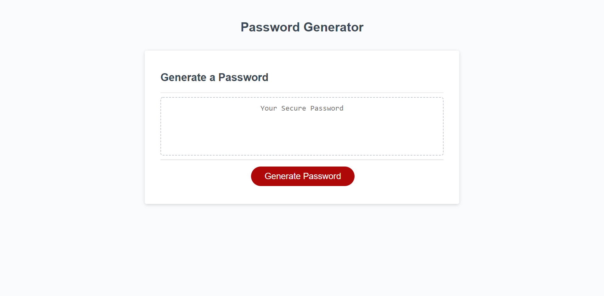
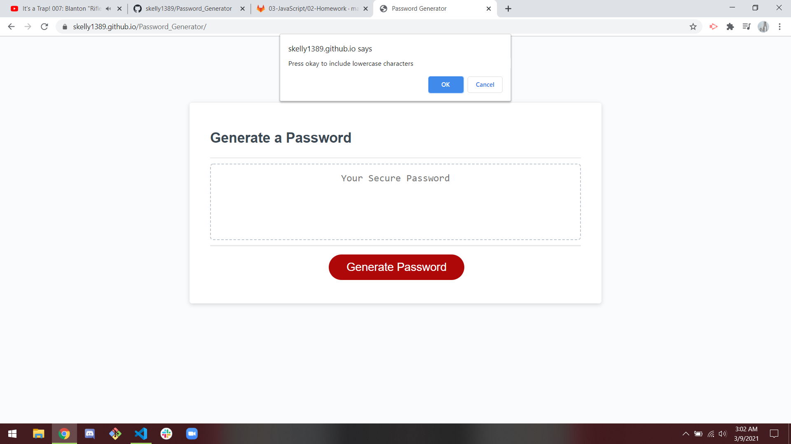
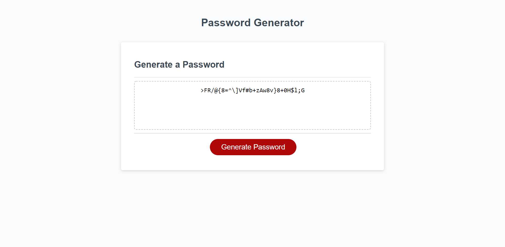

# Password Generator

## Description

Given basic html and css code was tasked with creating a secure password upon clicking a button. Password must be between 8 and 128
characters long, have options to contain different characters such as uppercase letters or numbers, and have at least one set of characters selected. 

## Installation

Live site at [https://skelly1389.github.io/Password_Generator/](https://skelly1389.github.io/Password_Generator/)

## Usage

When the red "Generate Password" button is pressed user is given a series of prompts:
    -How long should the password be? (8-128 characters accepted)
    -Three sets of symbols that can be used in any combination as long as at least one set is selected
    -Password is shown in box in middle of page that previously read "Your Secure Password"
    :
    
    :
    
    :
    

## Credits

html and css assets provided by Bootcamp

## License

MIT License

Copyright (c) 2021 Sean Kelly

Permission is hereby granted, free of charge, to any person obtaining a copy
of this software and associated documentation files (the "Software"), to deal
in the Software without restriction, including without limitation the rights
to use, copy, modify, merge, publish, distribute, sublicense, and/or sell
copies of the Software, and to permit persons to whom the Software is
furnished to do so, subject to the following conditions:

The above copyright notice and this permission notice shall be included in all
copies or substantial portions of the Software.

THE SOFTWARE IS PROVIDED "AS IS", WITHOUT WARRANTY OF ANY KIND, EXPRESS OR
IMPLIED, INCLUDING BUT NOT LIMITED TO THE WARRANTIES OF MERCHANTABILITY,
FITNESS FOR A PARTICULAR PURPOSE AND NONINFRINGEMENT. IN NO EVENT SHALL THE
AUTHORS OR COPYRIGHT HOLDERS BE LIABLE FOR ANY CLAIM, DAMAGES OR OTHER
LIABILITY, WHETHER IN AN ACTION OF CONTRACT, TORT OR OTHERWISE, ARISING FROM,
OUT OF OR IN CONNECTION WITH THE SOFTWARE OR THE USE OR OTHER DEALINGS IN THE
SOFTWARE.

## Badges

